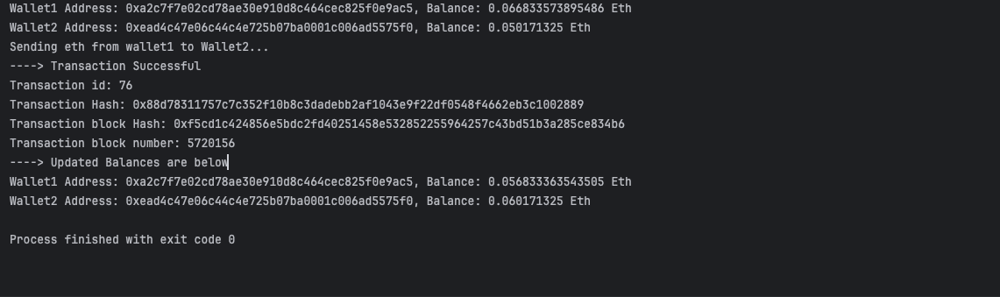

# Ethereum Wallet

A repository containing code showing how to interact with Ethereum network in different languages (using the preferred SDKs for each platform).

This repository mainly uses [Sepolia Ethereum Testnet](https://sepolia.etherscan.io/).

The code in this repository mainly focuses on showing the following functions in action.

1. Creating a Mnemonic Wallet
2. Loading a Mnenonic Wallet Credentials
3. Sending Eth transaction from one wallet to the other
4. Showing Transaction Details (successfull/failure)
5. Showing updated balances.

### Android
In Android [Web3j library](https://github.com/hyperledger/web3j) is used. 

#### Transfer Eth
 

#### Create New Wallet

#### Import Wallet

### Java

